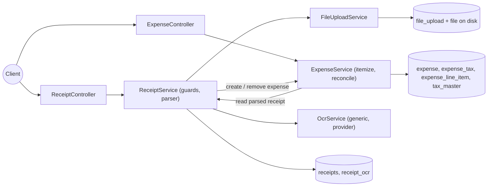
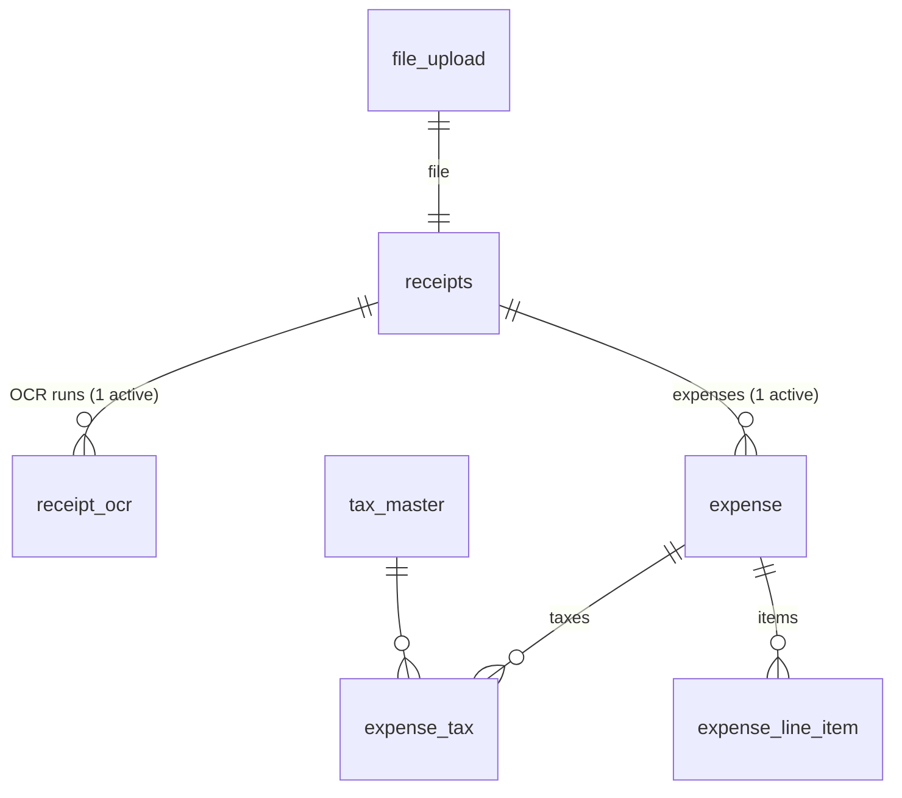
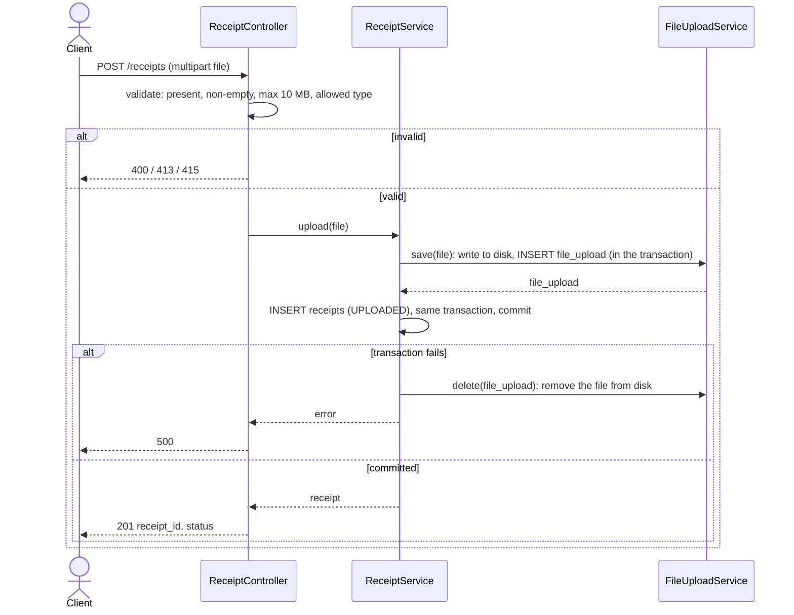
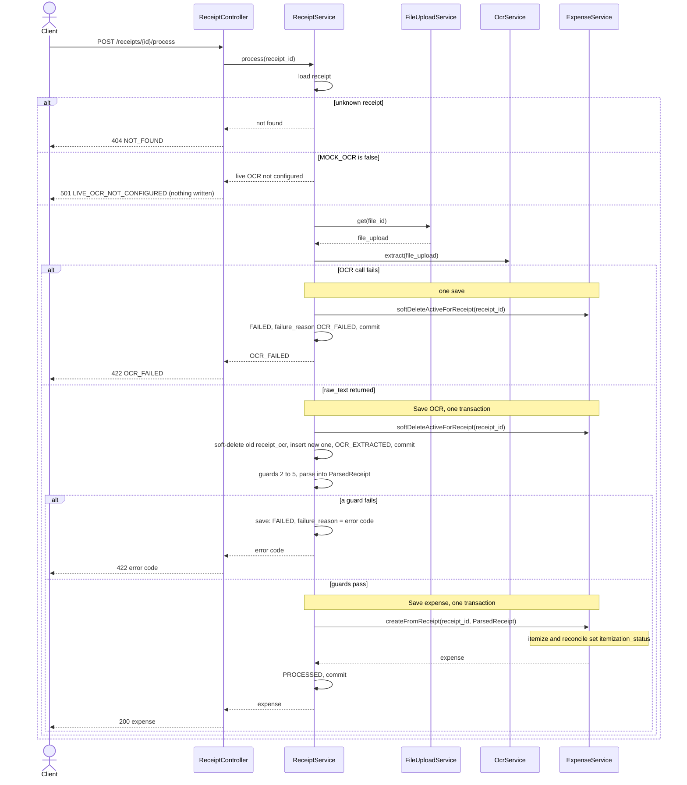
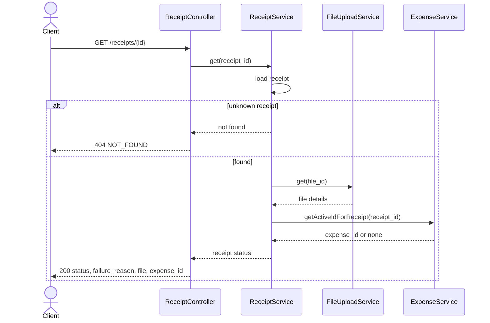
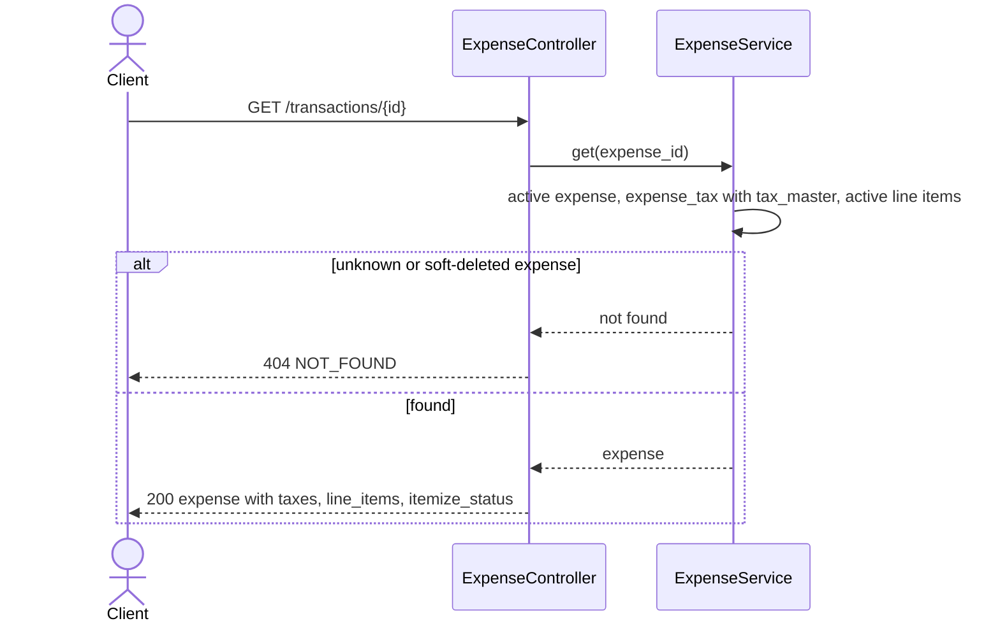
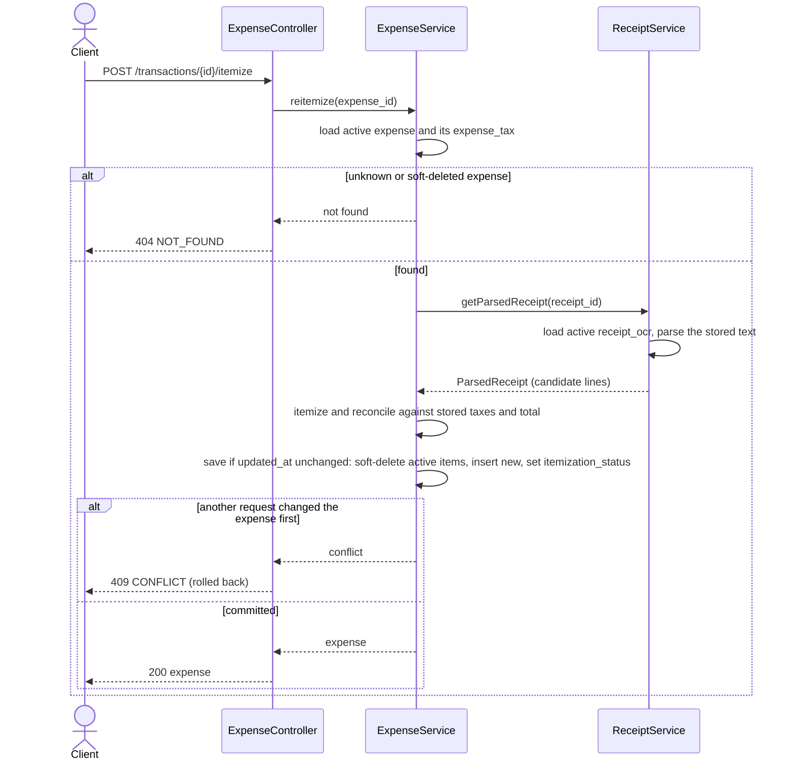
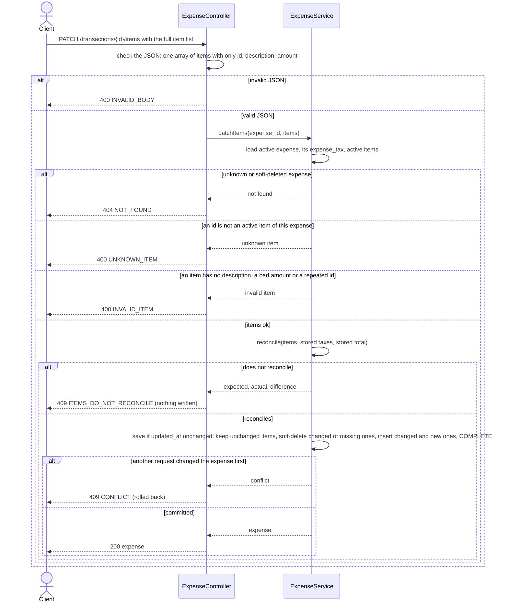
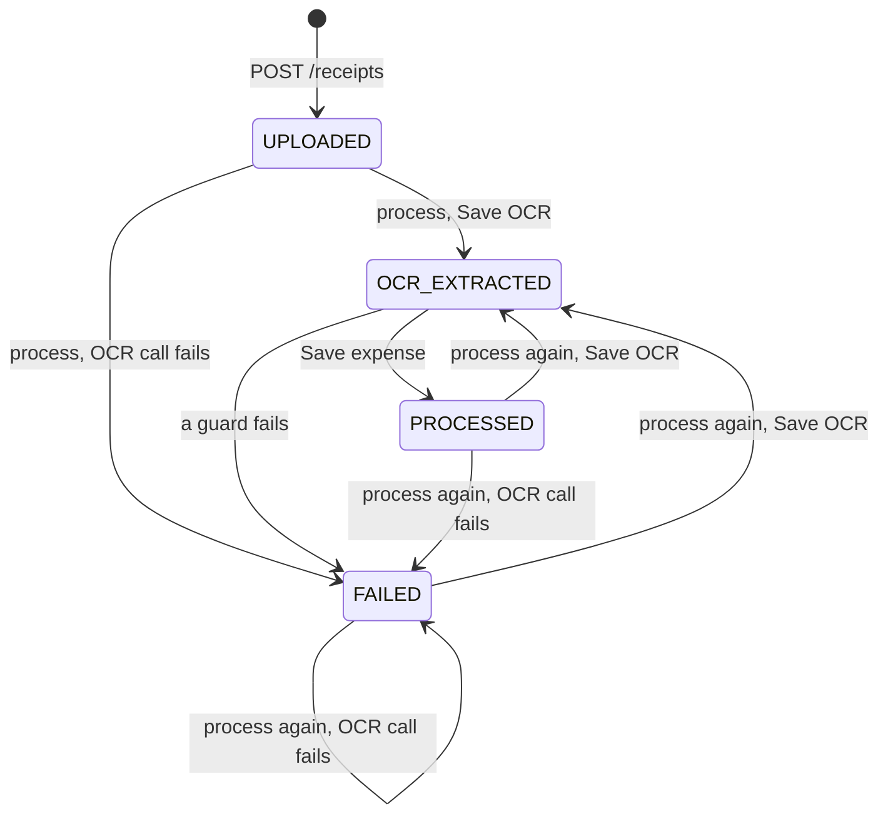
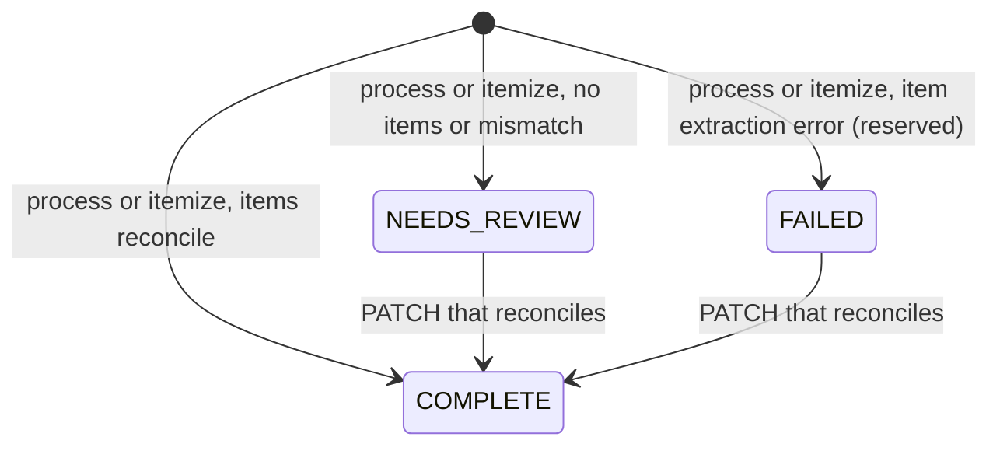

# Architecture — Receipt upload, taxes, auto-itemize

A small HTTP API that takes an uploaded receipt and creates **one expense** (the brief's "transaction") from it. It stores **taxes as their own records** and **auto-itemizes** the receipt into line items. If the numbers don't add up, it flags the expense for review. It never invents a line or changes a total to make the sums match.

**OCR is mocked** (`MOCK_OCR=true`). The service looks up mock OCR text by the uploaded file's name, and falls back to the gold OCR text when there's no match (§1.2). Live OCR is out of scope. The parser, guards and reconciliation logic run on the mock text as if it came from a real OCR engine.

This document describes **how the application works**. How it is built (language, libraries, code layout, tests) is in [IMPLEMENTATION_PLAN.md](IMPLEMENTATION_PLAN.md).

---

## 1. Components

Controllers handle HTTP only. Each service owns one area of the application and **only writes its own tables**. When a service needs data from another area, it calls that area's service instead of touching its tables.



| Component | Handles | Methods |
|---|---|---|
| **ReceiptController** | HTTP for `POST /receipts`, `POST /receipts/{id}/process` and `GET /receipts/{id}`. It checks the upload (present, size, type), calls `ReceiptService` and turns results and errors into status codes (§3.0). **No business logic.** | — |
| **ExpenseController** | HTTP for `GET /transactions/{id}`, `POST /transactions/{id}/itemize` and `PATCH /transactions/{id}/items`. It checks the shape of the `PATCH` body and calls `ExpenseService`. **No business logic.** | — |
| **ReceiptService** | **All receipt functionality.** Upload, the whole `process` flow and receipt status. It owns the receipt lifecycle (`status`, `failure_reason`), stores each OCR run, runs the **guards** (§1.3) and **parses** OCR text into receipt data. It also opens the transactions for the saves in `process` and passes them to the services it calls. | `upload(file)`, `process(receipt_id)`, `get(receipt_id)`, `getParsedReceipt(receipt_id)` (for re-itemize) |
| **ExpenseService** | **All expense functionality.** Creating the expense from a parsed receipt (header, taxes, line items), reading it, re-itemizing it and the user override. **Itemize and reconcile are internal steps here** (§4). | `createFromReceipt(receipt_id, parsed)`, `softDeleteActiveForReceipt(receipt_id)`, `getActiveIdForReceipt(receipt_id)`, `get(id)`, `reitemize(id)`, `patchItems(id, items)` |
| **OcrService** | **Generic OCR**: a file goes in and text comes out. It contains the OCR provider (mock or live, §1.2), stores nothing and knows nothing about receipts, so any other kind of document could use it. | `extract(file_upload) → raw_text` |
| **FileUploadService** | **File uploads.** Writes the file to `./storage/receipts/<uuid>.<ext>` and records it in `file_upload`. The uploaded name is only stored in `file_name`; it is never used to build a path. | `save(file)`, `get(file_id)`, `delete(file_upload)` (cleanup when the upload transaction fails) |

The receipt parser returns `ParsedReceipt { merchant, date, currency, total, subtotal?, taxes[], candidate_lines[] }`. The parser, the guards, itemize and reconcile are **pure functions** with no I/O, so they can be tested directly against `gold.json`.

**The two-way link between ReceiptService and ExpenseService.** The two services call each other, but for different reasons:
- **During `process`, `ReceiptService` calls `ExpenseService`**, to remove the old expense and create the new one.
- **During re-itemize, `ExpenseService` calls `ReceiptService`**, to read the stored OCR text parsed into lines. This is a single read, `getParsedReceipt(receipt_id)`.

### 1.1 What each component stores

| Component | Tables it writes | What it stores | Data it gets from other components |
|---|---|---|---|
| ReceiptController, ExpenseController | none | — | — |
| **FileUploadService** | `file_upload`, and the file on disk | Where the file is saved (`file_path`), the uploaded name (`file_name`), `content_type`, `size_bytes` | — |
| **OcrService** | none | — | The file to read, passed in by `ReceiptService` |
| **ReceiptService** | `receipts`, `receipt_ocr` | The link to the file (`file_id`), the lifecycle `status` and `failure_reason`, and the raw OCR text of each run (`ocr_payload`, with earlier runs soft-deleted) | File details from `FileUploadService`, raw text from `OcrService`, the active expense id from `ExpenseService` |
| **ExpenseService** | `expense`, `expense_tax`, `expense_line_item`, `tax_master` | The expense header (merchant, date, currency, total), `itemization_status`, taxes as printed, line items with their edit history, and the list of known tax names | The parsed receipt from `ReceiptService` (for re-itemize) |

**Saves that span services.** In `process`, one save can touch both the receipt tables and the expense tables. `ReceiptService` opens the transaction and passes it to the `ExpenseService` methods it calls, so each save is still **one transaction**. Every service reads with `is_deleted = 0`.

### 1.2 OCR mode (`MOCK_OCR`)

`OcrService` picks its provider at startup from `MOCK_OCR`. Upload works the same way in both modes: the file is always stored and a receipt is created. `MOCK_OCR` only changes where the OCR text comes from during `process`.

| `MOCK_OCR` | Provider inside `OcrService` | Behaviour |
|---|---|---|
| `true` | `MockOcrProvider` | 1. Take the stem of `file_upload.file_name`, e.g. `receipt-clean.png` → `receipt-clean`.<br>2. If mock OCR data exists under that name (`fixtures/task-a/<stem>.txt`, or our extra guard fixtures in `fixtures/mock-ocr/<stem>.txt`), return it as `raw_text`.<br>3. Otherwise **fall back to the gold OCR text**: `fixtures/task-a/receipt-clean.txt`, which can be changed with `MOCK_OCR_FALLBACK`. The fallback is logged. |
| `false` | `LiveOcrProvider` | Calls a real OCR vendor. **Out of scope for now.** `process` returns **501** `LIVE_OCR_NOT_CONFIGURED` before writing anything. |

### 1.3 Guards

The guards belong to `ReceiptService`. Guard 1 checks the result of the `OcrService.extract` call; guards 2–5 check the text and the parsed receipt. They run in order, and the first one that fails stops processing. Each failure sets `receipts.status = FAILED` and `receipts.failure_reason = <error code>`, and returns 422 with the error code.

These are our own checks on the OCR text. Our OCR returns only text, so every check is made on the text itself. Checks reported by the OCR provider (is it a receipt, is it legible, confidence) are future scope; see §5.

| # | Guard | Rule | Error |
|---|---|---|---|
| 1 | OCR call | The provider threw an error or timed out | `OCR_FAILED` |
| 2 | Readable | The text has at least 20 letters or digits | `OCR_UNREADABLE` |
| 3 | Is a receipt | There is a total line (`TOTAL` / `SUMME` / `GESAMT` / `AMOUNT DUE`) with an amount | `NOT_A_RECEIPT` |
| 4 | Header complete | Merchant, date, currency and total were all extracted, and **every tax line has a rate**. `VAT 2.85` with no `%` fails here. | `HEADER_INCOMPLETE` |
| 5 | Values make sense | total > 0; the date is a valid `YYYY-MM-DD` date and at most one day after today's UTC date (the receipt has no time zone, and in zones ahead of UTC it can already be tomorrow); the currency is a valid ISO 4217 code; 0 ≤ rate < 1 (0% is allowed); 0 ≤ tax_amount < total | `INVALID_RECEIPT_VALUES` |

The guards check whether the text is a **usable receipt**. They don't check whether its numbers add up; itemization handles that, and a mismatch gives `NEEDS_REVIEW`, not a failure.

A receipt with **no tax line** is not a guard failure. It gets zero `expense_tax` rows, and reconciliation then checks that the items alone add up to the total.

---

## 2. Data model

All tables have the audit columns `id`, `created_at`, `created_by`, `updated_at` and `updated_by`. There is no auth, so `created_by`/`updated_by` is `"system"` for pipeline writes and `"user"` for writes through `PATCH`.

Money columns are `NUMERIC(12,2)` and are handled as `Decimal` in code, **never float**. Tax rates are exact decimals, stored as printed: 19% is `0.19` and a Quebec QST of 9.975% is `0.09975`, never rounded.



### `file_upload`
**Owner:** `FileUploadService`

Details of the stored file. They are kept apart from `receipts` so the receipt only holds business data, and so other kinds of upload can reuse this table later.

| column | type | notes |
|---|---|---|
| file_path | TEXT | Where `FileUploadService` saved the file, e.g. `storage/receipts/<uuid>.png` |
| file_name | TEXT | Name of the file as uploaded, e.g. `receipt-clean.png`. The mock OCR looks up its data by this name. |
| content_type | TEXT | e.g. `image/png`, `application/pdf`, `text/plain` |
| size_bytes | INTEGER | |

### `receipts`
**Owner:** `ReceiptService`

| column | type | notes |
|---|---|---|
| file_id | FK → file_upload, UNIQUE | One file per receipt |
| status | TEXT | `UPLOADED` → `OCR_EXTRACTED` → `PROCESSED`, or `FAILED` |
| failure_reason | TEXT NULL | Error code of the guard that failed (e.g. `NOT_A_RECEIPT`, §1.3). Set together with `FAILED`, and cleared to NULL when the receipt reaches `PROCESSED`. Returned by `GET /receipts/{id}` (§3.3). |

### `receipt_ocr`
**Owner:** `ReceiptService`

| column | type | notes |
|---|---|---|
| receipt_id | FK → receipts | |
| ocr_payload | TEXT | Raw OCR text, stored verbatim. This is the **source of truth for re-itemize**. |
| is_deleted | BOOLEAN | A new OCR run soft-deletes the previous row. A partial unique index `(receipt_id) WHERE is_deleted = 0` allows one active row per receipt. |

### `expense` (the "transaction")
**Owner:** `ExpenseService`

| column | type | notes |
|---|---|---|
| receipt_id | FK → receipts | A partial unique index `(receipt_id) WHERE is_deleted = 0` allows **one active expense per receipt** |
| itemization_status | TEXT | `COMPLETE` \| `NEEDS_REVIEW` \| `FAILED`. Same names as `gold.json`; returned as `itemize_status`. |
| merchant | TEXT | Merchant or supplier |
| date | DATE | |
| currency | CHAR(3) | ISO 4217 |
| total | NUMERIC(12,2) | Grand total as printed on the receipt. **Never recomputed.** |
| is_deleted | BOOLEAN | Set when the receipt is processed again (see §3.2) |

### `expense_tax` (required: taxes as printed on the receipt)
**Owner:** `ExpenseService`

| column | type | notes |
|---|---|---|
| expense_id | FK → expense | |
| tax_master_id | FK → tax_master | Which tax (VAT, GST, …) |
| rate | exact decimal | Printed rate as a fraction, e.g. `0.19` for 19%; never rounded |
| taxable_amount | NUMERIC(12,2) NULL | Net amount the tax is charged on, when the receipt shows it: the base printed on the tax line (`VAT 19%  10.00  1.90` → `10.00`); otherwise, with exactly one tax line, the `Subtotal`, or for a tax-inclusive total (`incl. VAT`) `total − tax_amount`. Otherwise NULL: a subtotal shared by several taxes is no single tax's base, so it isn't copied onto their rows. |
| tax_amount | NUMERIC(12,2) | Tax amount as printed. **Never recalculated from the rate.** |

There is one row per tax per rate, and zero rows when the receipt prints no tax. This table is the **only** place tax is stored. See §5 for why taxes are not split across line items.

### `expense_line_item`
**Owner:** `ExpenseService`

| column | type | notes |
|---|---|---|
| expense_id | FK → expense | |
| name | TEXT | Line description |
| amount | NUMERIC(12,2) | **Net** amount, as in `gold.json`. Can be negative for discounts (e.g. `Rabatt -1.00`); never zero. |
| is_deleted | BOOLEAN | Changed or removed items are soft-deleted and new rows are inserted (see §3.5, §3.6) |

### `tax_master`
**Owner:** `ExpenseService`

| column | type | notes |
|---|---|---|
| name | TEXT **UNIQUE** | `VAT`, `GST`, `CGST`, `SGST`, … Seeded, and upserted by `ExpenseService` when a parsed receipt contains a new tax name. It is also the parser's list of tax names: they are loaded once at startup, so a new seed row or upserted name is recognised after the next restart (§4). |

**Soft deletes.** `receipt_ocr`, `expense` and `expense_line_item` have `is_deleted`. Child rows of a soft-deleted expense (its `expense_tax` and `expense_line_item` rows) are **not** flagged. They stay as they were and can only be reached through their deleted parent, which keeps the history intact.

---

## 3. What each endpoint does

### 3.0 Common behaviour
- **Error body** (every 4xx/5xx): `{ "error": "<CODE>", "message": "<human readable>", ...details }`. This includes an unknown path (404 `NOT_FOUND`), a known path with the wrong method (405 `METHOD_NOT_ALLOWED`, with an `Allow` header) and an unexpected error or panic (500 `INTERNAL_ERROR`: the details go to the server log, never to the client).
- **Unknown id** in a path: **404** `NOT_FOUND`. A soft-deleted expense counts as unknown.
- **Two requests at once** on the same receipt or expense (`process`, `itemize`, `PATCH`): the write is conditional on the row's `updated_at` being the value read at the start (`UPDATE … WHERE id = ? AND updated_at = ?`). If another request got there first, zero rows match, the whole transaction rolls back and the response is **409** `CONFLICT`. The client can retry. The partial unique indexes back this up at the database level.
- **`GET /health`** → `200 { "status": "ok" }`.

**Error codes**

| Status | `error` | When |
|---|---|---|
| 400 | `FILE_MISSING` | `POST /receipts` has no multipart field named `file` |
| 400 | `FILE_EMPTY` | The uploaded file has 0 bytes |
| 400 | `INVALID_UPLOAD` | `POST /receipts` isn't a multipart form |
| 400 | `INVALID_BODY` | The `PATCH` body isn't one JSON array of items: malformed JSON, `null`, a field other than `id`, `description` and `amount`, or anything after the array |
| 400 | `INVALID_ITEM` | A `PATCH` item has no description, an amount of 0 or with more than two decimals, or repeats an id (§3.6) |
| 400 | `UNKNOWN_ITEM` | A `PATCH` item's id isn't an active item of this expense |
| 404 | `NOT_FOUND` | An unknown receipt or transaction id (a soft-deleted transaction counts as unknown), or an unknown path |
| 405 | `METHOD_NOT_ALLOWED` | A known path with another method; the `Allow` header lists the right one |
| 409 | `CONFLICT` | Another request changed the same receipt or expense first; the client can retry |
| 409 | `ITEMS_DO_NOT_RECONCILE` | The `PATCH` items plus the taxes don't equal the total. The body adds `expected`, `actual` and `difference` (§3.6). |
| 413 | `FILE_TOO_LARGE` | The file is over 10 MB |
| 415 | `UNSUPPORTED_FILE_TYPE` | The file's type is missing, or isn't `image/*`, `application/pdf` or `text/plain` |
| 422 | `OCR_FAILED`, `OCR_UNREADABLE`, `NOT_A_RECEIPT`, `HEADER_INCOMPLETE`, `INVALID_RECEIPT_VALUES` | `process`: a guard failed (§1.3). The receipt is saved as `FAILED` with the code as its `failure_reason`. |
| 500 | `INTERNAL_ERROR` | Anything unexpected. The message is always `internal error`; the details are in the server log. |
| 501 | `LIVE_OCR_NOT_CONFIGURED` | `process` with `MOCK_OCR=false` (§1.2). Nothing is written. |

### 3.1 `POST /receipts`: upload



| Step | Action |
|---|---|
| Validate | A file must be present and non-empty (400), at most 10 MB (413), and be `image/*`, `application/pdf` or `text/plain` (415). `text/plain` is only allowed so the fixture `.txt` files can be uploaded. The type is the `Content-Type` the client sends for the file part, without parameters such as `charset`. The bytes aren't inspected, because the files are never served back and the mock OCR never reads them. |
| Disk | Save the file to `storage/receipts/<uuid>.<ext>` |
| `file_upload` | **INSERT** `file_path`, `file_name`, `content_type`, `size_bytes` (same transaction as the next row) |
| `receipts` | **INSERT** `file_id = file_upload.id`, `status = UPLOADED` |

Returns `201 { receipt_id, status }` with a `Location: /receipts/{id}` header. If the transaction fails, the saved file is deleted. There is no duplicate check, so uploading the same file twice creates two separate receipts.

### 3.2 `POST /receipts/{id}/process`: OCR, extraction and itemization



Processing a receipt again **overwrites** the earlier result, including any line item edits the user made. Each run creates a **new expense with a new id**. A receipt in any status can be processed again, and processing a `FAILED` receipt counts as a retry. In mock mode the stored file itself is never read; only `file_upload.file_name` is used.

Nothing is written until the OCR call has returned. After that there are **two saves**, and each is one DB transaction. The old expense is soft-deleted in the **same save that moves the status away from `PROCESSED`**, so no failure can leave a receipt marked `PROCESSED` without an expense.

| Phase | Tables | Action |
|---|---|---|
| **1. Pre-check** | — | If `MOCK_OCR=false`, return 501 `LIVE_OCR_NOT_CONFIGURED`. **Nothing is written.** |
| **2. OCR call** | — | `OcrService.extract(file_upload)` → `raw_text`. **Nothing is written.** |
| **3. Save OCR** (1 transaction) | `expense` | `ExpenseService.softDeleteActiveForReceipt`: if this receipt has an active expense, **soft-delete** it |
| | `receipt_ocr` | Soft-delete the active row, then **INSERT** a new one with `ocr_payload = raw_text`. This happens even if later guards fail, so the text that failed is kept for debugging. |
| | `receipts` | `status = OCR_EXTRACTED`, `failure_reason = NULL` |
| **4. Guards + parse** | — | `ReceiptService` runs guards 2–5 (§1.3) and parses the text into a `ParsedReceipt`, in memory. **Nothing is written.** |
| **5. Save expense** (1 transaction) | `tax_master` | `ExpenseService.createFromReceipt` (this row and the next four): upsert each tax name found |
| | `expense` | **INSERT** a new row with the header fields |
| | `expense_tax` | **INSERT** one row per parsed tax (`tax_master_id`, `rate`, `taxable_amount`, `tax_amount`) |
| | `expense_line_item` | **INSERT** the parsed items |
| | `expense` | Set `itemization_status` from itemize and reconcile (§4) |
| | `receipts` | `status = PROCESSED` |

**Failures**

| Where it stops | Save | Resulting state | Response |
|---|---|---|---|
| Guard 1: OCR call fails (`OCR_FAILED`) | One save: soft-delete the active expense, `status = FAILED`, `failure_reason = OCR_FAILED`. No OCR row is written, so the previous one stays active. | `FAILED`, no active expense | 422 |
| Guards 2–5 fail (`OCR_UNREADABLE`, `NOT_A_RECEIPT`, `HEADER_INCOMPLETE`, `INVALID_RECEIPT_VALUES`) | One save: `status = FAILED`, `failure_reason = <code>`. The OCR row from save 3 is kept. | `FAILED`, no active expense | 422 |
| The header passes every guard, but item extraction throws an error (reserved: the stub parser never fails, so this build doesn't produce it) | Save 5 goes ahead with no items and `itemization_status = FAILED` | `PROCESSED`, one active expense | 200 |
| Unexpected error or DB failure after save 3 | Nothing else is saved | `OCR_EXTRACTED`, no active expense | 500. Calling `process` again recovers it. |

In mock mode a missing fixture does **not** fail, because it falls back to the gold OCR text (§1.2).

If the client disconnects while the OCR call runs, nothing is written: that isn't an OCR failure. Only a provider error or a timeout is `OCR_FAILED`.

**Rule the status always follows:** `PROCESSED` means exactly one active expense. `UPLOADED`, `OCR_EXTRACTED` and `FAILED` mean none.

Returns `200` with the expense, in the same shape as §3.4.

### 3.3 `GET /receipts/{id}`: receipt status (read only)



Lets a client find a receipt's **current expense** (its id changes on every reprocess) and see **why the receipt failed**. Reads `receipts`, its `file_upload` row and the id of the active `expense`, if any. Returns 404 if the receipt is unknown.

```json
{
  "id": "…", "status": "FAILED", "failure_reason": "NOT_A_RECEIPT",
  "file": { "file_name": "not-a-receipt.txt", "content_type": "text/plain", "size_bytes": 171 },
  "expense_id": null,
  "created_at": "…", "updated_at": "…"
}
```

### 3.4 `GET /transactions/{id}`: read only



Reads the active `expense`, its `expense_tax` rows joined to `tax_master`, and its active `expense_line_item` rows **in the order they were inserted**. Returns **404** if the expense doesn't exist or has been soft-deleted.

```json
{
  "id": "…", "receipt_id": "…",
  "merchant": "Cafe Mitte", "date": "2026-03-12", "currency": "EUR", "grand_total": "17.85",
  "taxes": [{ "name": "VAT", "rate": "0.19", "taxable_amount": "15.00", "amount": "2.85" }],
  "line_items": [
    { "id": "…", "description": "Espresso", "amount": "3.50" },
    { "id": "…", "description": "Sandwich", "amount": "8.90" },
    { "id": "…", "description": "Mineral water", "amount": "2.60" }
  ],
  "itemize_status": "COMPLETE"
}
```

### 3.5 `POST /transactions/{id}/itemize`: re-itemize from stored OCR



| Step | Action |
|---|---|
| Read | The active `expense` (404 if missing). OCR is **not** called again. |
| Parse | `ReceiptService.getParsedReceipt(receipt_id)` parses the **active** `receipt_ocr` text. Only its **candidate lines** are used. |
| Reconcile | Against the **stored** `expense.total` and `expense_tax`. |
| `expense_line_item` | **Soft-delete** all active items, then **INSERT** the new ones (`created_by = system`) |
| `expense` | **UPDATE** `itemization_status` and `updated_*` only |

**Not touched:** `receipts`, `receipt_ocr`, the expense header and `expense_tax`. No second expense is created. This throws away the user's edits and goes back to the automatic result. If parsing throws, the old items are still soft-deleted and `itemization_status = FAILED` (reserved: the stub parser never fails; an error reading the stored OCR returns 500 and writes nothing).

Returns `200` with the expense, in the same shape as §3.4.

### 3.6 `PATCH /transactions/{id}/items`: user override



**Body:** the **complete** list of items the user wants: `[{ "id"?: "…", "description": "…", "amount": "…" }]`. Merging or splitting is expressed by the list itself, for example by leaving two ids out and adding one new item.

| Step | Action |
|---|---|
| Validate | Each item needs a non-empty description and a non-zero decimal amount with at most 2 decimal places. Negative amounts are allowed for discounts. Every `id` must be an active item of this expense (else **400** `UNKNOWN_ITEM`), and no `id` may appear twice. A broken rule gets **400** `INVALID_ITEM`. `ExpenseService` checks these rules, not the controller, so no caller can store a rounded or duplicated item. The controller only checks the JSON: one array whose items have no fields besides `id`, `description` and `amount` (a `tax_amount` isn't silently dropped), else **400** `INVALID_BODY`. `amount` can be sent as `"6.60"` or `6.60`; both are read exactly. An empty list `[]` is valid input, but it only reconciles if the taxes alone equal the total, so in practice it gets a 409. |
| Reconcile | Check that the sum of the items plus the sum of `expense_tax.tax_amount` equals `expense.total` (§4) |
| ❌ Doesn't reconcile | Return **409** and write **nothing**. Example below. |
| ✅ Reconciles | One transaction; see the next table |

What happens to each item once the list reconciles:

| Item in the request | Action |
|---|---|
| Has an `id`, and its description and amount are unchanged | Keep it; the id stays the same |
| Has an `id`, but its description or amount changed | **Soft-delete** the old row and **INSERT** a new row (`created_by = user`) |
| Has no `id` | **INSERT** a new row |
| An active item that is missing from the request | **Soft-delete** it |
| `expense` | `itemization_status = COMPLETE`, `updated_by = user` |

Returns **200** with the updated expense, in the same shape as §3.4. Items come back in the order they were inserted (§3.4), so unchanged items keep their place and changed or new items follow them, in request order.

Here is the 409 response for `receipt-mismatch` when the user sends only Water and Snacks:
```json
{ "error": "ITEMS_DO_NOT_RECONCILE", "message": "Items plus taxes do not equal the total",
  "expected": "18.50", "actual": "11.90", "difference": "6.60" }
```
The endpoint never changes the total or the taxes. To resolve a review, the user must supply the missing lines themselves. For example, adding an item of 6.60 is allowed because the user adds it, not the system.

### 3.7 Status lifecycle

**`receipts.status`**



A receipt left at `OCR_EXTRACTED` by an unexpected error is recovered by calling `process` again, which follows the same transitions.

**`expense.itemization_status`**



Re-itemize recomputes the status from scratch, so it can move an expense from any status to any other.

---

## 4. Itemization and reconciliation rules

Both are internal steps of `ExpenseService`. They are used when an expense is created in `process`, on re-itemize and on `PATCH`.

**Candidate lines** are lines with a description and a non-zero amount, printed above the total line. Negative amounts count, because they are discounts. These lines are excluded: `Subtotal`, `TOTAL`, tax lines (`VAT 19%`, `incl. VAT …`), lines with no amount (for example `Trip fare`), lines of `0.00`, and anything printed under the total, such as payment lines (`Cash 20.00`, `Change -2.15`).

**Tax lines** are recognised by name, using the names in `tax_master` (§2). A line with a rate is a tax when its name contains one of those names as a whole word, so `State Tax 6%` and `CGST 9%` are taxes. A line without a rate must be exactly one of those names, so `VAT 2.85` is a tax (and then fails guard 4). `Discount 10%` and `Service charge 10%` stay items. A tax line may print its base before the tax amount, as in a tax table: `VAT 19%  10.00  1.90` is VAT with base 10.00 and tax 1.90. Header, summary and tax lines are read wherever they are printed. A receipt that prints its total above its items therefore gets no items and `NEEDS_REVIEW`, which the user resolves with `PATCH`.

**Reconciliation** uses **net amounts only**, with a tolerance of `0.01`:

```
Σ item.amount + Σ expense_tax.tax_amount == total        (no tax rows → Σ item.amount == total)
```

There is deliberately **no gross fallback**. `expense_line_item.amount` is defined as net, so accepting items that add up to the total by themselves would let gross amounts into a net column. This applies to `PATCH` as well. A receipt that prints gross line prices therefore gets `NEEDS_REVIEW`, and the user corrects the items through `PATCH`.

**Status decision**

| Case | `itemization_status` | Items stored |
|---|---|---|
| Items found and they reconcile | `COMPLETE` | parsed items |
| No candidate lines | `NEEDS_REVIEW` | none, so `line_items: []` |
| Items found but they don't reconcile | `NEEDS_REVIEW` | parsed items **as printed**, with no balancing line |
| The header passed the guards, but item extraction throws an error (reserved for a parser that can fail, such as live OCR; the stub parser never does) | `FAILED` | none |

An unusable OCR payload never reaches itemization, because the guards in §1.3 fail the whole receipt first.

**Expected results on the fixtures**

| Fixture | expense_tax (rate / taxable / tax) | Check | Status |
|---|---|---|---|
| `receipt-clean` | 0.19 / 15.00 / 2.85 | 15.00 + 2.85 = 17.85 ✓ | `COMPLETE` |
| `receipt-tax-only` | 0.19 / 20.17 / 3.83 (incl.) | no items | `NEEDS_REVIEW` |
| `receipt-mismatch` | 0.19 / 10.00 / 1.90 | 10.00 + 1.90 = 11.90 ≠ 18.50 | `NEEDS_REVIEW`, total stays 18.50 |

---

## 5. Out of scope (for now)

### Splitting tax across line items

Tax is stored **only on the expense**, in `expense_tax`. Line items carry no tax. Here's why:

- **None of the fixtures print tax per item.** Each has one `VAT 19%` line for the whole receipt, and the `gold.json` line items have no tax field.
- **Receipts state tax per rate, not per line.** German receipts mark each line with a rate code (A = 19%, B = 7%) and print the tax amount per rate at the bottom (§ 14 Abs. 4 UStG). Tax is rounded once per rate for the whole document.
- **Splitting a tax amount across lines would produce invented numbers.** Per-line rounding can also end up a cent away from the printed tax. For `receipt-tax-only` there are no items to split across, and for `receipt-mismatch` any split would be a guess.
- **Expense tools such as Concur and Expensify** attach a tax *rate/code* to each itemized line, mainly to handle receipts that mix rates (for example a hotel room at 7% and breakfast at 19%).

**Planned design, not built:**

| Table | Columns | Filled from |
|---|---|---|
| `expense_line_item_tax` | `expense_line_item_id`, `tax_master_id`, `rate`, `tax_amount` | Only from real evidence: a rate code printed per line, or per-item tax the user sends through `PATCH`. Never calculated by the itemizer. |

When it is built, `PATCH` will also check that **the item taxes add up to `expense_tax.tax_amount` for each tax and rate**. If they don't, it returns 409 in the same way as the total check.

### Live OCR with a vision model (for later)

The fixtures are plain OCR text: `.txt` is the OCR output, and `gold.json` is what our extraction should produce from it. They carry no image, no confidence scores and no document checks, so today every guard works on the text alone (§1.3).

**Planned: checks reported by the OCR provider.** When a live provider is added (`MOCK_OCR=false`), `extract()` would return `{ raw_text, checks }`, where `checks = { is_receipt, is_legible, confidence }`. These checks would run **before** our text guards:

| Check | Rule | Error |
|---|---|---|
| OCR says it isn't a receipt | `checks.is_receipt == false` | `NOT_A_RECEIPT` |
| OCR says it can't read it | `checks.is_legible == false`, or `checks.confidence` below a threshold (e.g. `OCR_MIN_CONFIDENCE = 0.6`) | `OCR_UNREADABLE` |

Our text guards would **still always run** afterwards. They are the backstop for when the OCR misses something, for example when it reports `is_receipt: true` but the text has no total.

What the common services can report:

| Check | Available from |
|---|---|
| Is it a receipt or document at all (`is_receipt`) | Veryfi (`is_document`, `is_transaction`); a GPT vision model when asked through a JSON schema |
| Image quality: blurry, unreadable (`is_legible`) | Veryfi (`is_blurry`, OCR score), Google Document AI (image quality) |
| Confidence per field (`confidence`) | AWS Textract (0–100 per field), Azure Document Intelligence and Google Document AI (per field). GPT vision has no reliable score, so we'd ask it to return `null` for anything it can't read. |
| Tax details with rate and net amount | Azure `TaxDetails` (`Amount`, `Rate`, `NetAmount`), which maps directly onto `expense_tax` |
| Fraud: screenshots, AI-generated or edited receipts, duplicates | Veryfi fraud suite |

A vision model's JSON schema guarantees the **shape** of its answer, not that the values are correct. It can still report a total that isn't on the receipt. That's why our text guards always run, and why reconciliation and 409s never trust the OCR's numbers blindly.

**Needed when live OCR is built:**
- Add `checks` to the `extract()` result, and store them alongside the raw text in `receipt_ocr`.
- Accept structured fields from the provider, or make the parser handle real receipt layouts. The current parser is written for the fixture format: labelled `MERCHANT:` / `DATE:` / `CURRENCY:` lines, ISO dates, ISO currency codes and dot decimals.
- Fraud and duplicate detection remain out of scope.

**Also out of scope:** live OCR (`MOCK_OCR=false`, §1.2), auth (hence `created_by = system/user`), async processing or queues, production file storage, multiple currencies on one receipt, and quantity or unit price on line items.

---

## 6. Decisions and trade-offs

- **Mock OCR behind an interface, switched by `MOCK_OCR`.** The brief says matching the gold fixtures is the bar. A live vendor can be added later as another provider inside `OcrService` without changing anything else, and the guards will apply to it unchanged.
- **Controllers do HTTP only, and each service owns its own tables.** `ReceiptService` owns the receipt tables, `ExpenseService` the expense tables and `FileUploadService` the upload table. No service writes another service's tables. A save that spans services is still one transaction, because `ReceiptService` opens it and passes it on.
- **`OcrService` is generic.** It turns a file into text and knows nothing about receipts. Everything receipt-specific (the guards, the parser, storing OCR runs) is in `ReceiptService`, so the OCR part can be reused for other documents and swapped for a live vendor without touching receipt logic.
- **Parsing, guards, itemize and reconcile are pure functions.** They can be unit tested directly against `gold.json`, and auto-itemize and `PATCH` share exactly the same reconcile rule.
- **`process` saves twice and writes nothing before the OCR call returns.** The old expense is removed in the same save that moves the status away from `PROCESSED`, so the status always matches the expense. This avoids holding a DB transaction open across a slow OCR call, and a receipt stuck at `OCR_EXTRACTED` is recovered by calling `process` again.
- **Reprocessing soft-deletes the expense and creates a new one.** The result of each run is kept, the receipt never has more than one active expense, and the database enforces this with a partial unique index.
- **Line items are soft-deleted, not updated in place.** Every change keeps the earlier version. Items that didn't change keep their ids, so clients can keep referring to them.
- **Raw OCR is kept, with old runs soft-deleted.** Re-itemize can be repeated and gives the same result, and the OCR history of each receipt is kept.
- **The printed values are the source of truth.** `total` and `tax_amount` are stored exactly as printed and never recomputed. A mismatch is reported through `NEEDS_REVIEW` or a 409, never corrected by the system.
